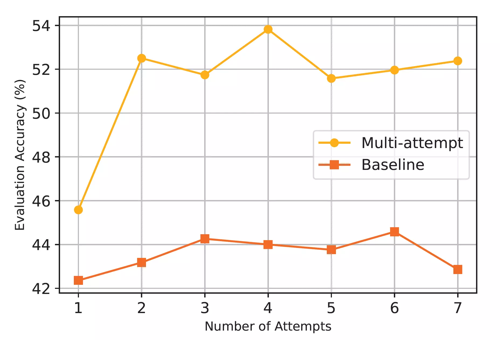
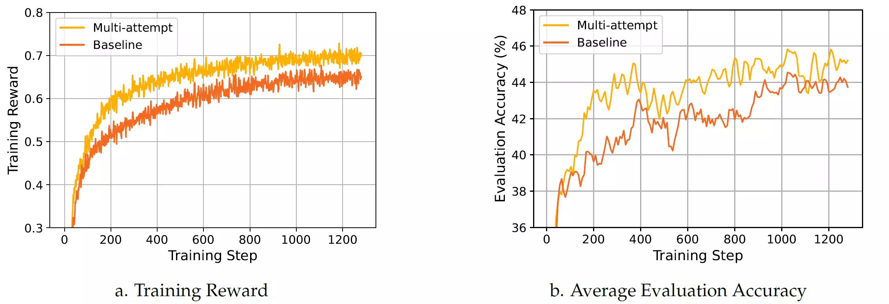
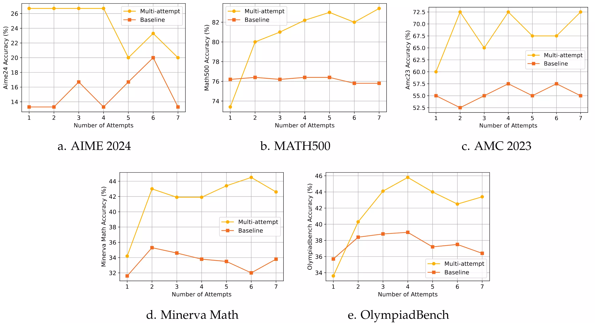

<div align="center">

# Learning From Failures in Multi-Attempt Reinforcement Learning

[](https://gossamer-bookcase-8a7.notion.site/Learning-From-Failures-in-Multi-Attempt-Reinforcement-Learning-1a6215521f3a80df9b14d48306a9f7a2) 

</div>

This repo contains our implementation of multi-attempt reinforcement learning for large langauge models. Instead of generating a single response per question, our proposed method allows multiple attempts, with feedback provided after incorrect responses. The multi-attempt task assigns rewards based on correctness across attempts, encouraging the model to refine its previous attempts and improve search efficiency.

Our preliminary experiments show that even a small LLM (e.g. **Qwen2.5-Math-1.5B**) trained on a multi-attempt task achieves significantly higher accuracy when evaluated with more attempts, **improving the avarage accuacy across five math benchmarks (AIME 2024, MATH 500, AMC 2023, Minerva Math, and OlympiadBench) from 45.6% with 1 attempt to 52.5% with 2 attempts**. This suggests that the model effectively learns to leverage previous failed attempts to refine its responses. In contrast, the same LLM trained on a standard single-turn task exhibits only a marginal improvement, increasing from 42.3% to 43.2% when given 2 attempts during evaluation. The results indicate that, compared to the standard single-turn task, an LLM trained on a multi-attempt task achieves better performance on math benchmarks while also learning to refine its responses more effectively based on user feedback.

You can check our Notion blog or refer to the Introduction below for more details.

<div align="center">

</div>


> Evaluation accuracy as a function of the number of allowed attempts during evaluation, averaged across five benchmarks: AIME 2024, MATH 500, AMC 2023, Minerva Math, and OlympiadBench. Both LLMs are based on Qwen 2.5 Math 1.5B and fine-tuned via RL on a small math dataset in either multi-attempt tasks or single-turn tasks (baseline).

## Introduction
Recent advancements in large-scale post-training of reinforcement learning (RL) for large language models (LLMs) have shown promise in enhancing reasoning capabilities, leading to emergent abilities like self-correction and self-refinement. Most existing methods rely on single-turn tasks, where the model receives a reward based on the correctness of its single response to a question. However, single-turn tasks may be inefficient due to sparse rewards, and they do not require the LLM to learn how to respond to user feedback. In this work, we propose a simple yet effective multi-turn task that enables LLMs to learn reasoning through RL.

Instead of requiring the LLM to provide a single response to a given question, we propose a *multi-attempt* task that allows the LLM to generate multiple responses based on feedback. Specifically, we first randomly sample $N$ as the number of remaining attempts for each question. The model initially generates a response to a given question as usual. If the response is correct or there are no remaining attempts (i.e., $N\leq1$), the dialogue ends. However, if the response is incorrect and there are remaining attempts (i.e., $N>1$), we provide feedback indicating that the answer is incorrect and prompt the LLM to try again, while decrementing the remaining attempts $N$ by 1.

Our preliminary experiments show that even a small LLM, such as a 1.5B model, can effectively learn self-refinement capabilities. As illustrated in the above Figure, the evaluation accuracy of an LLM trained on a multi-attempt task improved from 45.6% to 52.5% on math benchmark when increasing the number of attempts from 1 to 2. In contrast, the same model trained on a single-turn task showed only a marginal gain, from 42.3% to 43.2%. We also observe that even under the standard 1-attempt evaluation, the multi-attempt LLM outperforms its single-turn counterpart, highlighting the benefits of multi-attempt training. **We are currently scaling up the experiment to a 7B model and anticipate even greater improvements.**

<div align="center">

</div>

> Training and evaluation performance of the LLMs. (a) Training reward as a function of training steps. (b) Average evaluation accuracy across five benchmarks as a function of training steps, evaluated under the standard single-attempt setting.

<div align="center">

</div>

> Evaluation accuracy as a function of the number of allowed attempts during evaluation on individual benchmarks.

## Quick Start

### Installation

Our code is adopted from [SimpleRL-Zero](https://github.com/hkust-nlp/simpleRL-reason) which is based on OpenRLHF. Please follow [OpenRLHF's guidance](https://github.com/OpenRLHF/OpenRLHF/tree/main?tab=readme-ov-file#installation) to configure required environments and install our version:

```bash
git clone https://github.com/DualityRL/Multi-Attempt.git
cd eval
pip install -e .
cd ../train
pip install -e .
```

### Reproducing Multi-Attempt Training
We follow the settings from [SimpleRL-Zero](https://github.com/hkust-nlp/simpleRL-reason) to post-train Qwen2.5-Math-1.5B model. 

The training process leverages PPO with Ray and vLLM for acceleration. For simplicity, we only use one node with 8 GPUs for training. It takes around 4 days to complete training on a node with 8 A100s.

```bash
cd train

# For baseline RL training:
/bin/bash examples/script/baseline.sh

# For multi-attempt RL training:
/bin/bash examples/script/multi_attempt.sh
```

### Evaluate

We follow [SimpleRL-Zero](https://github.com/hkust-nlp/simpleRL-reason) to use [Qwen Math's codebase](https://github.com/QwenLM/Qwen2.5-Math/tree/main/evaluation) for evaluation, but for fairness considerations, we completely prohibited solving problems by calling code. By default, the evaluation will be done every 8 steps during training.

To evaluate the trained LLMs in multi-attempt setting, run the following lines in `train` by setting `$RUN` to your run name (e.g. `baseline` or `multi_attempt`):

```bash
for dataset in amc23 aime24 math500 minerva_math olympiadbench; do 
  for step in 1 2 3 4 5 6 7; do 
    python openrlhf/duality/vllm_mul.py --model large_data/checkpoints/$RUN/_actor_hf/best --dataset $dataset --min_attempt ${step} --max_attempt ${step} --output_dir large_data/eval/$RUN/${step}attempt/
  done
done
```

## Citation

If you find this blog or our code useful, we would appreciate it if you could cite our work:

```bibtex
@misc{chung2025multiattempt,
  title={Learning from Failures in Multi-Attempt Reinforcement Learning},
  author={Stephen Chung and Wenyu Du and Jie Fu},
  year={2025},
  howpublished={\url{https://gossamer-bookcase-8a7.notion.site/Learning-From-Failures-in-Multi-Attempt-Reinforcement-Learning-1a6215521f3a80df9b14d48306a9f7a2}},
  note={Notion Blog}
  year={2025}
}
```

## Acknowledgement
We implement our multi-attempt RL from [SimpleRL-Zero](https://github.com/hkust-nlp/simpleRL-reason) and [OpenRLHF](https://github.com/OpenRLHF/OpenRLHF). We follow [SimpleRL-Zero](https://github.com/hkust-nlp/simpleRL-reason) to utilize [vLLM](https://github.com/vllm-project/vllm) for inference and develop evaluation scripts based on [Qwen2.5-Math](https://github.com/QwenLM/Qwen2.5-Math/tree/main/evaluation). 

## Contact

For any questions or discussions, please contact us at stephen.chung@dualityrl.com or wenyu.du@dualityrl.com.